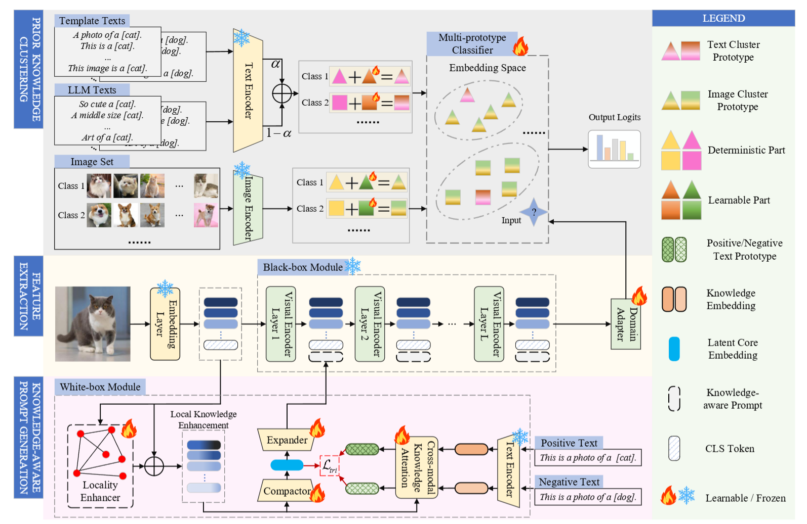

# KPMC
Enhancing Pre-trained ViTs for Downstream Task Adaptation: A Locality-Aware Prompt Learning Method [ACM MM 24]


## Abstract
> Prompt learning based on foundation models has garnered increasing attention due to its ability to significantly reduce the computational cost and rapidly adapt to downstream tasks. However, existing methods lack the perceptual capability to capture local fine-grained information in images and simultaneously struggle to address the issue of curved classification boundaries. To overcome these challenges, we propose Knowledge-aware Prompt for few-shot tuning with Multi-prototype Clustering (KPMC), which can enhance pre-trained models’ few-shot adaptation while mitigating catastrophic forgetting. From a global perspective, KPMC introduces a multi-prototype clustering mechanism tightly coupled with dataset-intrinsic knowledge. This approach preserves the general representation power of foundation models to alleviate catastrophic forgetting while optimizing few-shot learning through clustering refinement and domain-specific prior integration. On the local front, KPMC innovatively integrates a data-driven black-box module (e.g., ViT) with a knowledge-aware prompt generation architecture. The latter constructs fine-grained feature graphs from images and employs maximum relative graph convolution to model interdependencies among local features. Extensive evaluations across four downstream tasks demonstrate the superiority of our proposed KPMC over state-of-the-art (SOTA) methods. For example, under the 8-shot experimental setting, KPMC achieves average accuracy improvements of 1.35% over existing SOTA approaches across 12 benchmark datasets. 

## Framework




## Datasets
For the classification task, we evaluate our method across three categories of datasets: (1) Natural datasets, including CIFAR-10, CIFAR-100, DTD, and ImageNet; (2) Fine-grained datasets, including Flowers102, Stanford-Cars, FGVC-Aircraft, and Stanford Dogs; and (3) Specialized datasets, including EuroSAT, Resisc45, UCF101, and Pattern.

Comprehensive statistics of these datasets are summarized in Table X. For Stanford Dogs, CIFAR-10, CIFAR-100, DTD, ImageNet, Resisc45, and Pattern, we adopt the official dataset split strategy. For Flowers102, Stanford Cars, FGVC-Aircraft, EuroSAT, and UCF101, we follow the split strategy introduced in CoOp.


For example, after obtaining the StanfordCars dataset, you can copy its path to the corresponding config file (cars_cnet_xx.json "data_path").

## Installation
Install all requirements required to run the code on a Python 3.x by:
> First, you need activate a new conda environment.
> 
> conda env create -f environment.yml


## Data processing
All commands should be run under the project root directory. 

```
sh data_processing.sh
```

## Training
After downloading the datasets you need, you can use this command to obtain training samples used in few-shot and easy-to-hard classification task.

```
sh run.sh
```

For example, after obtaining the eth_cars_8.npy (StanfordCars dataset, easy-to-hard classification task, 8/stage), you can copy its path to the corresponding config file (cars_cnet_h8.json "new_dir").  

## Results
Results will be saved in log/.  
